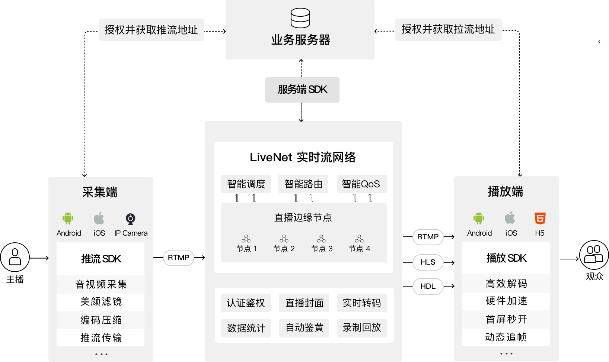
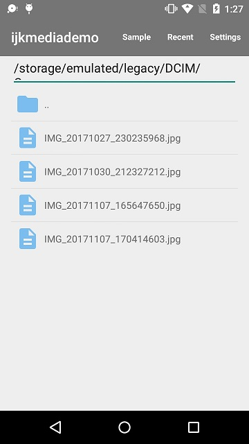
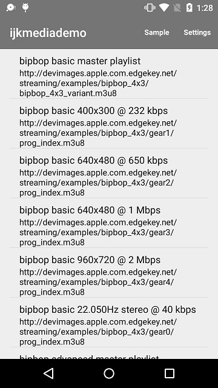
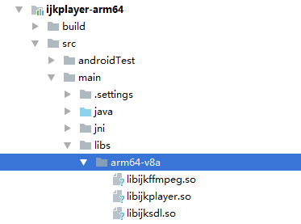
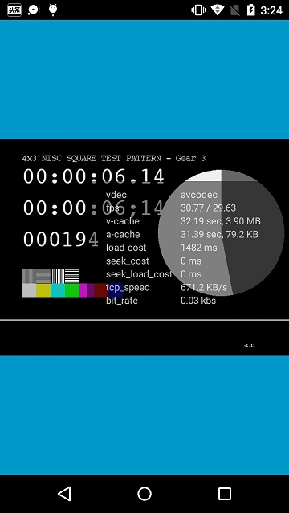
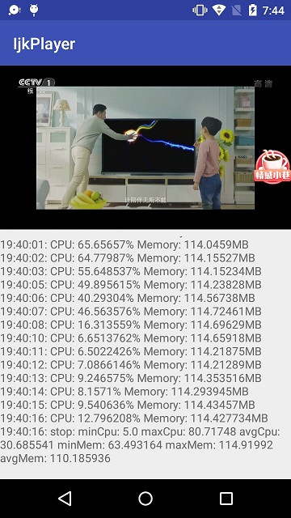
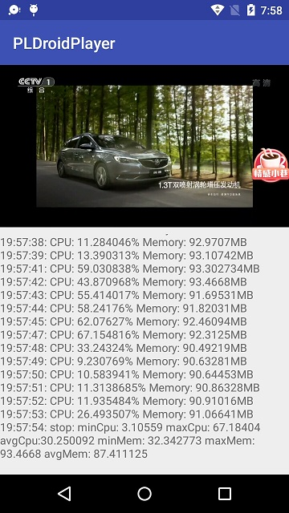
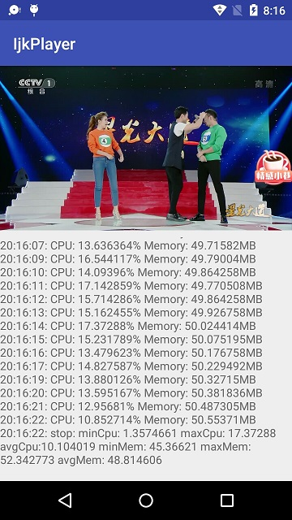
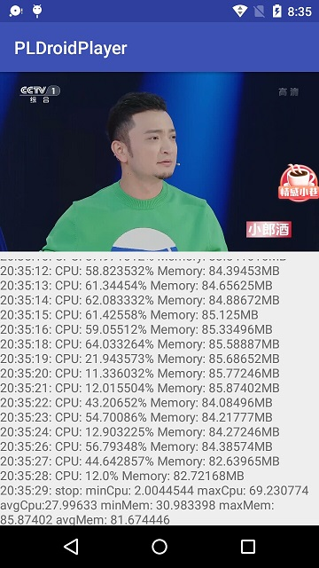

# Android视频直播播放器哪家强？ #
最近几年，视频直播在应用市场热火朝天，同事基友见面，自己做的app里没有直播功能都不好意思跟人家打招呼，大大小小的公司前赴后继，纷纷扑向这个风口，希望能够飞一把，当然有的飞起来了，有的飞走了，有的还没起飞。面对这样庞大的市场需求，BAT不用说，都已搭起自己的云服务招徕顾客，七牛、金山等也不甘示弱，所以，直播这一块的技术和市场相对来说都已经比较成熟，这时候在应用中添加直播或点播功能，可能只需要一杯咖啡的时间。

那么问题来了，我需要一个播放器来播放视频流，那该如何选择呢？除了原生的VideoView（VideoView表示臣妾做不到啊），还有一些播放器如Vitamio，B站开源的IjkPlayer等，当然各大直播云服务商也提供了自己的播放器。这里需要了解到的是各大服务商的播放器一般并没有跟其直播服务进行绑定，举个栗子，我使用七牛的播放器可以播放BAT的云服务传递过来的视频流，BAT的播放器也可以播放七牛传输的视频流。

如何选择，我们可以通过拍脑袋或者随机数决定，当然，作为程序员，我们也可以用数据来说话。所以，我们接下来对一些播放器拆箱使用，进行数据分析和对比，看一看到底哪家强？

## 基础 ##
在进行对比之前，我们需要对直播相关的基础概念做一些简单介绍，如果对这一块比较熟悉的同学可以跳过。
### 视频直播 ###
视频直播就是视频数据从采集端（摄像头）通过网络实时推送到播放端（手机，电脑，电视等），我们最早接触到的视频直播可能就是电视直播了，但随着智能手机发展，移动直播兴起，它的视频采集端是手机，播放端通常也是手机。

### 视频点播 ###
视频点播就是一段已经录制好的视频数据，用户可以点击播放。由于是已经录制完成的视频数据，所以还可以控制播放进度。

### 直播协议 ###
直播协议常见的有三种：RTMP、Http-FLV和HLS。

* RTMP: 基于TCP协议，由Adobe设计,将音视频数据切割成小的数据包在互联网上传输，延时3s以内，但拆包组包复杂，在海量并发情况下不稳定。由于不是基于Http协议，存在被防火墙墙掉的可能性。
* Http-FLV：基于Http协议，由Adobe设计，在大块音视频数据头部添加标记信息，延时3s以内，海量并发稳定，手机浏览器支持不足。
* HLS：基于Http协议，由Apple设计，将视频数据切分成片段（10s以内），由m3u8索引文件进行管理，高延时（10s到30s），手机浏览器支持较好，可通过网页转发直播链接。

### 软编码和硬编码 ###
音视频数据在互联网上传输之前，由于存在冗余数据，需要进行压缩编码，编码存在两种方式，一种是软编码一种是硬编码。

* 软编码：使用CPU进行编码
* 硬编码：使用非CPU进行编码，如GPU等

### 软解码和硬解码 ###
数据进行编码之后传输到播放端，就要进行解码，那么解码也有两种方式，一种是软解码一种是硬解码。

* 软解码：使用CPU进行解码
* 硬解码：使用非CPU进行解码

### 直播业务逻辑 ###
大部分的直播业务逻辑基本是相似的，以七牛为例：

1. 采集端向业务服务器（如App的后台）请求推流（推送视频流）地址
2. 业务服务器请求LiveNet(云服务)获取推流地址并转发给采集端，保存记录（如url，房间号等）
3. 采集端获取到推流地址后，使用RTMP协议进行推流
4. 播放端请求业务服务器获取拉流地址
5. 播放端使用拉流地址获取视频流进行播放

## IjkPlayer ##
IjkPlayer是B站开源播放器，地址为：[https://github.com/Bilibili/ijkplayer](https://github.com/Bilibili/ijkplayer)，基于音视频编解码库FFmpeg，支持常用的直播协议。IjkPlayer只提供播放器引擎库，不提供UI界面，所以使用IjkPlayer时还需要对UI界面进行二次封装，不过Github上有一些基于ijkplayer二次开发的播放器，他们对UI界面做了比较好的封装。

通过git命令：

	git clone https://github.com/Bilibili/ijkplayer.git
下载ijkplayer完整项目，然后使用Android Studio打开目录：ijkplayer\android\ijkplayer，这个是Android的Demo项目，运行之后，效果如下：

但是，我们暂时还是无法播放示例视频列表当中的视频，还需要编译so库。在编译so库的过程中，躺坑躺到怀疑人生，跟大家分享一下，避免跟我一样踩坑。

### Windows下编译IjkPlayer ###

首先大家**最好不要在Windows环境下编译**，因为我使用的是Windows系统，所以没有多想，下载代码后安装Cygwin，然后在Cygwin中安装make,yasm，装完之后以为大功告成，开始在Cygwin的命令行中执行编译脚本，但执行时报错，因为sh脚本还需要转换成unix版本，于是在Cygwin中又装了个dos2unix，将ijkplayer中的所有的sh脚本全部转换了一遍，然后再执行脚本，在读取一个配置文件configure又出了问题，还是文件格式问题，所以可以预见即使解决了这个文件，后续可能还有一大堆的文件存在这样的问题，细思极恐，果断弃坑。

### Ubuntu下编译IjkPlayer ###
弃坑Windows后又在电脑的虚拟机上安装了Ubuntu系统，可是等在Ubuntu上面搭建完Android开发环境后，发现硬盘空间不足了，不要问我为什么空间不足，反正就是不足了，我能怎么办，我只能选择原谅自己咯。后来想到我原来的一台笔记本里面装了Ubuntu 16.04，于是擦擦上面的灰，开机启动。

#### 搭建Android开发环境
1.安装JDK

	sudo add-apt-repository ppa:webupd8team/java
	sudo apt-get update
	sudo apt-get install oracle-java8-installer
	sudo apt-get install oracle-java8-set-default

	//在命令行中使用java -version，java, javac命令不报命令找不到，就算安装成功

2.安装Android Studio

去官网或者[国内站点](http://www.android-studio.org/)下载Linux版本的Android Studio，这里，我使用的是Android Studio3.0版本。下载完成后，将Android Studio解压到/opt目录，然后使用命令行执行Andorid Studio中的bin/studio.sh启动Android Studio，进入向导界面，向导界面最后确认去下载SDK。下载完成后SDK路径为/home/xxx（用户名）/Android/Sdk。

3.下载NDK

使用Android Studio下载完SDK后，不用创建项目，直接打开SDK Manager，在里面去下载NDK，下载完成之后存放在sdk目录下的ndk-bundle目录，但这里下载的NDK版本是比较新的版本16，而ijkplayer编译也是不支持的，因为在ijkplayer\android\contrib\tools中有个sh脚本会检查编译环境，其中有一段代码会检查NDK版本：
	
	case "$IJK_NDK_REL" in
	    10e*)
	        ........
	        echo "IJK_NDK_REL=$IJK_NDK_REL"
	        case "$IJK_NDK_REL" in
	            11*|12*|13*|14*)
	                if test -d ${ANDROID_NDK}/toolchains/arm-linux-androideabi-4.9
	                then
	                    echo "NDKr$IJK_NDK_REL detected"
	                else
	                    echo "You need the NDKr10e or later"
	                    exit 1
	                fi
	            ;;
	            *)
	                echo "You need the NDKr10e or later"
	                exit 1
	            ;;
	        esac
	    ;;
	esac
可以看出来这里只支持10e,11,12,13,14,15,所以**ndk版本高了不行，低了也不行**，没办法，我们得去重新去[官网](https://developer.android.google.cn/ndk/downloads/index.html)下载低一点的版本，如r14b。

4.配置SDK和NDK路径

找到/home/leon(用户名)目录，使用快捷键Ctrl + H显示隐藏文件，找到.bashrc文件打开，配置自己的SDK和NDK路径例如：

	export ANDROID_NDK=/home/leon/Android/andriod-ndk-r14b
	export ANDROID_SDK=/home/leon/Android/Sdk
	export PATH=$ANDROID_NDK:$ANDROID_SDK:$PATH

配置完成后，重启命令行，输入ndk-build命令，如果不报命令行找不到，说明NDK环境变量配置成功。

#### 编译IjkPlayer ####
Android环境搭建好后，就可以参考官方文档着手手编译ijkplayer了。

	sudo apt-get update
	sudo apt-get install git //安装git
	sudo apt-get install yasm //安装yasm

	sudo dpkg-reconfigure dash  //在弹出提示框选择“否”来使用bash
	
	//下载ijkplayer到ijkplayer-android目录
	git clone https://github.com/Bilibili/ijkplayer.git ijkplayer-android
	cd ijkplayer-android 
	
	//使用默认配置
	cd config
	rm module.sh
	ln -s module-lite.sh module.sh
	
	cd ..
	cd android/contrib
	./compile-ffmpeg.sh clean  //清理

	cd ~/ijkplayer-android          //返回源码根目录
	./init-android.sh               //主要是去下载ffmpeg
	
	cd android/contrib
	./compile-ffmpeg.sh clean
	./compile-ffmpeg.sh all         //编译ffmpeg，all是全部编译，需要等待一段时间
	
	cd ..                            //回到ijkplayer-android/android
	./compile-ijk.sh all             //编译ijkplayer

编译完成后，在android/ijkplayer目录下各个库模块当中找到生成的so库：

既然so库已经生成，就可以使用Andorid Studio再次打开ijkplayer中的安卓示例项目（android/ijkplayer），运行后就可以播放示例视频了。这个带有so库的示例项目我已上传到Github，地址为[https://github.com/uncleleonfan/IjkplayerExample](https://github.com/uncleleonfan/IjkplayerExample),欢迎下载。

## PLDroidPlayer ##
PLDroidPlayer 是七牛推出的一款适用于 Android 平台的播放器 SDK，采用全自研的跨平台播放内核，拥有丰富的功能和优异的性能，可高度定制化和二次开发。示例项目地址为：[https://github.com/pili-engineering/PLDroidPlayer](https://github.com/pili-engineering/PLDroidPlayer)。
PLDroidPlayer的集成要比ijkPlayer简单很多，不用自己编译so库，不用自己创建SurfaceView和TextureView来播放视频。可参考官方[开发指南](https://developer.qiniu.com/pili/sdk/1210/the-android-client-sdk)集成即可。

## 测试开发 ##
为了保证测试的变量只是播放器引擎本身（这里暂时将播放器引擎简单的理解为各个播放器的MediaPlayer），我们定义一个公共的UI界面即VideoView来播放视频流，然后通过代理模式去代理不同的播放器引擎。这样VideoView在播放视频时，可以通过代理使用不同的播放引擎（MediaPlayer）来播放。我们这里主要测试播放器播放视频首开的时间，播放器播放视频过程中Cpu，内存的占用情况。测试项目地址为:[https://github.com/uncleleonfan/PlayerCompare](https://github.com/uncleleonfan/PlayerCompare),测试项目运行效果：

### IMediaPlayer ###
定义统一的MediaPlayer接口。

	public interface IMediaPlayer {
	
	    void prepareAsync() throws IllegalStateException;
	
	    void start() throws IllegalStateException;
	
	    void stop() throws IllegalStateException;
	
	    void pause() throws IllegalStateException;
	
	    void release();
	
	    void reset();

		.......
	}
### IMeidaPlayerProxy ###
定义MeidaPlayer的代理接口，所有MediaPlayer的代理必须实现newInstance接口创建MediaPlayer。

	interface IMediaPlayerProxy {
	    IMediaPlayer newInstance();
	}

### IjkPlayer的MediaPlayer的代理 ###
在使用IjkPlayer之前需要添加依赖，并且将编译好的so库添加到项目中的jniLibs下。
		
	//添加ijkplayer依赖
	dependencies {
	    compile 'tv.danmaku.ijk.media:ijkplayer-java:0.8.4'
	    compile 'tv.danmaku.ijk.media:ijkplayer-armv7a:0.8.4'
	    compile 'tv.danmaku.ijk.media:ijkplayer-x86:0.8.4'
	
	}
	
	//IjkMediaPlayer代理，实现IMediaPlayer接口
	public class IjkMediaPlayerProxy implements IMediaPlayerProxy, IMediaPlayer {
	
		//声明一个IjkMediaPlayer对象
	    private IjkMediaPlayer mIjkMediaPlayer;
	
	    @Override
	    public IMediaPlayer newInstance() {
            //创建IjkMeidaPlayer对象
	        mIjkMediaPlayer = new IjkMediaPlayer();
	        return this;
	    }
	
	    @Override
	    public void prepareAsync() throws IllegalStateException {
	        mIjkMediaPlayer.prepareAsync();
	    }
	
	    @Override
	    public void start() throws IllegalStateException {
	        mIjkMediaPlayer.start();
	    }
	
	    @Override
	    public void stop() throws IllegalStateException {
	        mIjkMediaPlayer.stop();
	    }
		......
	}
	

### PLDroidPlayer的MediaPlayer代理 
在使用PLMediaPlayer之前参考[官方文档]((https://developer.qiniu.com/pili/sdk/1210/the-android-client-sdk))集成PLDroidPlayer

	//PLMediaPlayer代理，实现IMediaPlayer接口
	public class PLMediaPlayerProxy implements IMediaPlayerProxy, IMediaPlayer {

		//定义PLMediaPlayer对象
	    private PLMediaPlayer mMediaPlayer;
		//AVOptions为MediaPlayer的选项配置，例如可以配置开启硬解码
	    private AVOptions mAvOptions;
	
	
	    @Override
	    public IMediaPlayer newInstance() {
			//创建PLDroidPlayer的PLMediaPlayer对象
	        mMediaPlayer = new PLMediaPlayer(mContext, mAvOptions);
	        return this;
	    }
	
	
	    @Override
	    public void prepareAsync() throws IllegalStateException {
	        mMediaPlayer.prepareAsync();
	    }
	
	    @Override
	    public void start() throws IllegalStateException {
	        mMediaPlayer.start();
	    }
	
	    @Override
	    public void stop() throws IllegalStateException {
	        mMediaPlayer.stop();
	    }
	
		........
	}

### VideoView
VideoView仿照原生VideoView的实现，这里主要修改的是MediaPlayer的逻辑，方便配置使用不同播放器的MediaPlayer。

	public class VideoView extends SurfaceView implements IMediaPlayer.OnPreparedListener,
	        IMediaPlayer.OnErrorListener,
	        IMediaPlayer.OnCompletionListener,
	        IMediaPlayer.OnInfoListener,
	        IMediaPlayer.OnVideoSizeChangeListener{

		//定义MediaPlayer代理
	    private IMediaPlayerProxy mMediaPlayerProxy;
	
		//定义VideoView使用的MediaPlayer
	    private IMediaPlayer mMediaPlayer;
	
	
		//设置MediaPlayer的代理
	    public void setMediaPlayerProxy(IMediaPlayerProxy mediaPlayerProxy) {
	        mMediaPlayerProxy = mediaPlayerProxy;
	    }
	  
		//打开视频
	    private void openVideo() {
	        if (mVideoPath == null) {
	            return;
	        }
	        release();
			//使用代理创建对应的MediaPlayer对象
	        mMediaPlayer = mMediaPlayerProxy.newInstance();
	        mMediaPlayer.setScreenOnWhilePlaying(true);
	        mMediaPlayer.setDisplay(mSurfaceHolder);
	        mMediaPlayer.setLogEnabled(BuildConfig.DEBUG);
	        mMediaPlayer.setOnPreparedListener(this);
	        mMediaPlayer.setOnInfoListener(this);
	        mMediaPlayer.setOnCompletionListener(this);
	        mMediaPlayer.setOnErrorListener(this);
	        mMediaPlayer.setOnVideoSizeChangeListener(this);
	        try {
	            mMediaPlayer.setDataSource(mVideoPath);
				......
	            mMediaPlayer.prepareAsync();
	        } catch (IOException e) {
	            e.printStackTrace();
	        }
	    }
	
	    @Override
	    public void onPrepared(IMediaPlayer iMediaPlayer) {
	        iMediaPlayer.start();//开始播放
	    }
	}

### LogUtils ###
LogUtils用于采样cpu和内存数据，里面使用ScheduledThreadPoolExecutor每隔1s采样一次数据。

	
	//开始采样
    public void start() {
        scheduler.scheduleWithFixedDelay(new SampleTask(), 0L, 1000L, TimeUnit.MILLISECONDS);
    }
	//停止采样
    public void stop() {
        scheduler.shutdown();
    }

	//采样任务
	private class SampleTask implements Runnable {

        @Override
        public void run() {
            float cpu = sampleCPU();//采样CPU使用
            float mem = sampleMemory()；//采样内存使用
        }
    }

### LogView ###
打印Log的自定义控件，它有一个TextView和ScrollView组成，TextView在ScrollView用来内部来显示log,ScrollView用来滚动。

	public class LogView extends RelativeLayout {
	
	    public LogView(@NonNull Context context, @Nullable AttributeSet attrs) {
	        super(context, attrs);
	        LayoutInflater.from(context).inflate(R.layout.view_log, this);
	
	        final TextView textView = findViewById(R.id.tv);
	        final ScrollView scrollView = findViewById(R.id.scroll_view);
	        final StringBuilder stringBuilder = new StringBuilder();
			
			//监听LogUtils的log
	        LogUtils.getInstance().setOnUpdateLogListener(new LogUtils.OnUpdateLogListener() {
	            @Override
	            public void onUpdate(final long timestamp, final String msg) {
					//在主线程刷新界面
	                post(new Runnable() {
	                    @Override
	                    public void run() {
	                        String dateString = mSimpleDateFormat.format(new Date(timestamp));
	                        String log = dateString + ": " + msg + "\n";
							//添加一行log
	                        stringBuilder.append(log);
							//设置log显示
	                        textView.setText(stringBuilder.toString());
							//滚动ScrollView到底部
	                        scrollView.fullScroll(View.FOCUS_DOWN);
	                    }
	                });
	
	            }
	        });
	    }
	
	}

## 测试 ##
测试视频流是：
	
	//点播MP4视频
	String path = "http://hc.yinyuetai.com/uploads/videos/common/2B40015FD4683805AAD2D7D35A80F606.mp4?sc=364e86c8a7f42de3&br=783&rd=Android";
	//HLS直播流
	String path = "http://ivi.bupt.edu.cn/hls/cctv1hd.m3u8";

在VieoView里MediaPlayer开始准备之前，初始化LogUtils并埋点记录MediaPlayer准备时间

    try {
		//设置视频源
        mMediaPlayer.setDataSource(mVideoPath);
		//初始化LogUtils
        LogUtils.getInstance().init(getContext());
		//记录开始准备时间
        LogUtils.getInstance().onStartPrepare();
        mMediaPlayer.prepareAsync();
    } catch (IOException e) {
        e.printStackTrace();
    }

当MediaPlayer准备好后，会回调onPrePared，再次记录准备结束时间，这样，准备结束时间减去准备开始时间就是MediaPlayer准备耗时，即我们的首开时间。

	//准备好后的回调
    @Override
    public void onPrepared(IMediaPlayer iMediaPlayer) {
		//记录准备结束时间
        LogUtils.getInstance().onEndPrepare();
		//开始播放
        iMediaPlayer.start();
		//开始每隔1s采样，播放结束后停止采样，主要用于点播采样
        LogUtils.getInstance().start();
		
		//开始每隔1s采样，采样5min,5min之后，自行停止，主要用于直播采样
		//LogUtils.getInstance().startForDuration(5);
    }

	//播放结束
    @Override
    public void onCompletion(IMediaPlayer iMediaPlayer) {
		//播放结束，停止采样
        LogUtils.getInstance().stop();
    }

### 测试IjkPlayer ###
创建一个IjkPlayerActivity使用IjkMediaPlayer来播放视频。
	
	public class IjkPlayerActivity extends AppCompatActivity{
	
	    @Override
	    protected void onCreate(@Nullable Bundle savedInstanceState) {
	        super.onCreate(savedInstanceState);
	        setContentView(R.layout.activity_ijkplayer);
	
	 
	        //初始化IjkPlayer
	        IjkMediaPlayer.loadLibrariesOnce(null);
	        IjkMediaPlayer.native_profileBegin("libijkplayer.so");
	
	        VideoView videoView = findViewById(R.id.video_view);
			//设置IjkMediaPlayer代理
	        videoView.setMediaPlayerProxy(new IjkMediaPlayerProxy());
	        String path = "视频url"
			//设置视频url
	        videoView.setVideoPath(path);
	    }
	
	
	    @Override
	    protected void onStop() {
	        super.onStop();
			//通知IjkMediaPlayer结束
	        IjkMediaPlayer.native_profileEnd();
	    }
	
	}
另外，在VideoView初始化MediaPlayer时，可以调用enableMediaCodec()来开启IjkPlayer的硬解码：
	 
	private void openVideo() {
			.......
	        mMediaPlayer.enableMediaCodec();
	 }
### 测试PLDroidPlayer ###
创建一个PLDroidPlayerActivity使用PLMediaPlayer来播放视频。

	public class PLDroidPlayerActivity extends AppCompatActivity{
	
	    @Override
	    protected void onCreate(@Nullable Bundle savedInstanceState) {
	        super.onCreate(savedInstanceState);
	        setContentView(R.layout.activity_pldroid);
	
	        VideoView mVideoView = findViewById(R.id.video_view);
	
			//配置AVoptions来开启硬编码，默认为软编码
	        AVOptions avOptions = new AVOptions();
	        avOptions.setInteger(AVOptions.KEY_MEDIACODEC, AVOptions.MEDIA_CODEC_HW_DECODE);
	
	        mVideoView.setMediaPlayerProxy(new PLMediaPlayerProxy(this, avOptions));
	        String path = "视频url";
	        mVideoView.setVideoPath(path);
	    }
	
	}

## 测试结果 ##

### Round 1 ###

* 机型：Moto G (2代)
* 系统版本：5.1
* 数据源：String path = "http://ivi.bupt.edu.cn/hls/cctv1hd.m3u8";
* 软硬编码：**软解码**
* 采样时长：5min

> IjkPlayer结果

* 首开时间：1559ms
* CPU占比最小值:5.00%
* CPU占比最大值:80.72%
* 平均CPU占比：30.69%
* 内存使用最小值：63.49MB
* 内存使用最大值:114.92MB
* 平均内存：110.19MB

### PLDroidPlayer结果 ###
* 首开时间:198ms
* CPU占比最小值:3.11%
* CPU占比最大值:67.18%
* 平均CPU占比：30.25%
* 内存使用最小值：32.34MB
* 内存使用最大值:93.47MB
* 平均内存:87.41MB

### Round 2 ###

* 机型：Moto G (2代)
* 系统版本：5.1
* 数据源：String path = "http://ivi.bupt.edu.cn/hls/cctv1hd.m3u8";
* 软硬编码：**硬解码**
* 采样时长：5min

> IjkPlayer结果

* 首开时间：2280ms
* CPU占比最小值:1.36%
* CPU占比最大值:17.37%
* 平均CPU占比：10.10%
* 内存使用最小值：45.37MB
* 内存使用最大值:52.34MB
* 平均内存：48.81MB

### PLDroidPlayer结果 ###
* 首开时间:174ms
* CPU占比最小值:2.00%
* CPU占比最大值:69.23%
* 平均CPU占比：28.00%
* 内存使用最小值：30.98MB
* 内存使用最大值:85.87MB
* 平均内存:81.67MB

### 总结 ###
这里只是几次采样数据，需要结果更具说服力，可能还需要更多的测试条件和测试数据，不过我们可以从当前获取到的数据推断：不管是软解码和硬解码，PLDroidPlayer的首开速度都要远快于IjkPlayer；在软解码条件下，PLDroidPlayer的Cpu和内存消耗都要略低于IjkPlayer；在硬解码条件下，PLDroidPlayer的Cpu和内存消耗都要高于IjkPlayer。

